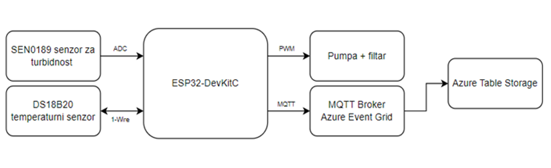
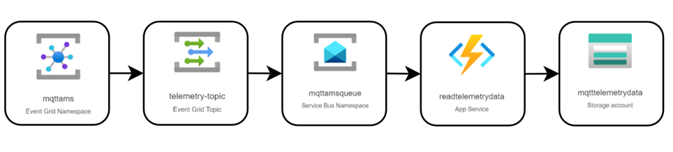
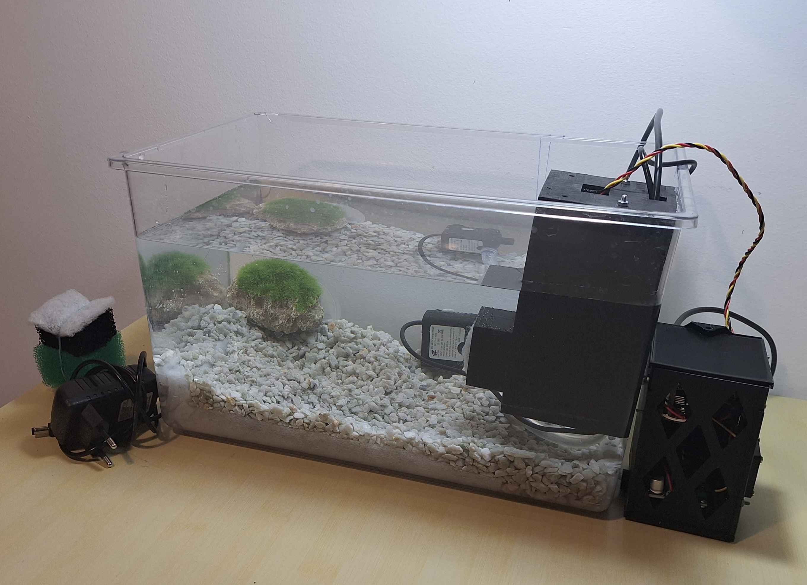

# 🐠 Aquarium Water Quality Monitor

An embedded system for continuous, automated monitoring and maintenance of aquarium water quality — measuring temperature and turbidity, controlling a pump/filter, and pushing data to the cloud.

---

## ✨ What It Does

| Feature | Details |
|---|---|
| 🌡️ Temperature | DS18B20 sensor via 1-Wire |
| 💧 Turbidity | SEN0189 analog sensor + median/deadzone filtering |
| ⚙️ Pump Control | Auto PWM regulation based on turbidity |
| 📡 Connectivity | Wi-Fi with auto-reconnect (FreeRTOS) |
| ☁️ Cloud | Sensor data → Azure Table Storage via MQTT over TLS |

---

## 🔧 Hardware

- **ESP32-DevKitC** — main microcontroller (Wi-Fi, dual-core)
- **DS18B20** — waterproof digital temperature sensor
- **SEN0189** — analog turbidity sensor (DF Robot)
- **DC water pump** — MOSFET-switched, PWM-controlled
- **4-stage filter** — mechanical filtration driven by the pump
- **12V adapter** + **5V regulator** — power supply chain

---

## 🖥️ System Overview



---

## ☁️ Cloud Architecture



```
ESP32 → MQTT/TLS → Azure Event Grid → Service Bus Queue → Function App → Table Storage
```

Telemetry is published every 60 seconds in the format:
```
<temperature>|<turbidity>    e.g. 27.500000|234
```

---

## 🚀 Quick Start

1. **Install** [ESP-IDF v5.x](https://docs.espressif.com/projects/esp-idf/en/stable/esp32/get-started/)
2. **Provision Azure** — Event Grid Namespace, Service Bus, Function App, Table Storage
3. **Generate TLS certs** with OpenSSL and place them in `ESP/main/certificates/` and `ESP/main/keys/`
4. **Configure** Wi-Fi credentials and MQTT broker via `idf.py menuconfig`
5. **Build & flash:**
```bash
cd "Programski kod/ESP"
idf.py build
idf.py -p <PORT> flash monitor
```

---

## 📁 Project Structure

```
├── Programski kod/
│   ├── ESP/               # ESP32 firmware (ESP-IDF)
│   │   ├── components/    # Drivers: Wi-Fi, DS18B20, pump, turbidity
│   │   └── main/          # App entry point + TLS certs/keys
│   └── Azure/             # Function App — Service Bus consumer → Table Storage
├── 3D modeli/             # 3D-printed enclosure
└── Slike/ & Text/         # Images and thesis documentation
```

---

## 🧪 Test Results



Tested continuously for **12 hours** on a small acrylic aquarium:

- ✅ Data successfully uploaded every 60 s throughout
- ✅ Auto-recovery from Wi-Fi and MQTT disconnections
- ✅ Median + deadzone filter effectively suppressed sensor noise
- ⚠️ Gradual turbidity drift due to sedimentation — periodic sensor cleaning recommended

---

## 🛠️ Common Issues

| Issue | Fix |
|---|---|
| Won't connect to Wi-Fi | Check SSID/password in config |
| MQTT refused | Regenerate certs; re-register device in Azure |
| Turbidity reads 0 | Check wiring to GPIO33; confirm sensor is submerged |
| Temperature reads 85°C | Check pull-up resistor on 1-Wire data line |
| No data in Table Storage | Check Service Bus backlog; review Function App logs |

---

*Developed as an undergraduate thesis at the Faculty of Electrical Engineering and Computing, University of Zagreb.*